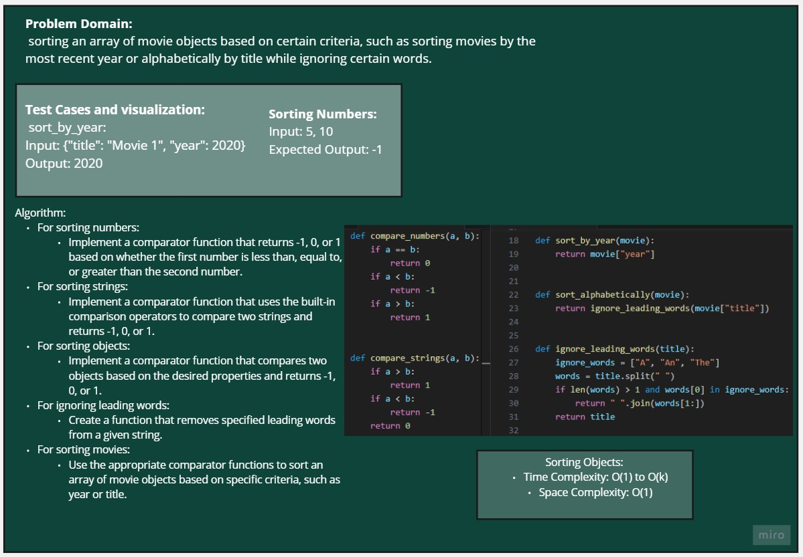
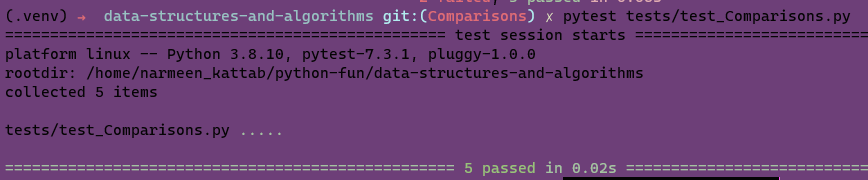

## PROBLEM DOMAIN

 sorting an array of movie objects based on certain criteria, such as sorting movies by the most recent year or alphabetically by title while ignoring certain words.

## white board:

## Approach & Efficiency
Sorting Numbers:

Time Complexity: O(1)
Space Complexity: O(1)

Sorting Strings:

Time Complexity: O(n)
Space Complexity: O(1)

Sorting Objects:

Time Complexity: O(1) to O(k)
Space Complexity: O(1)

Ignoring Leading Words:

Time Complexity: O(n)
Space Complexity: O(n)

Sorting Movies:

Time Complexity: O(n log n)

## Solution
