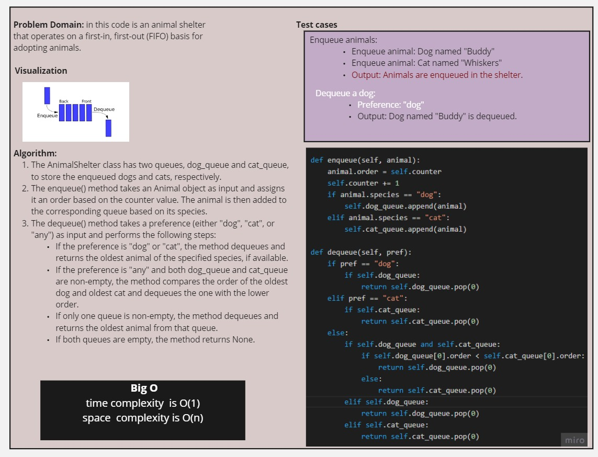
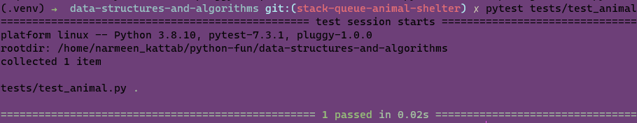

# First-in, First out Animal Shelter.

<!-- Description of the challenge -->
Implement an animal shelter that operates on a first-in, first-out (FIFO) basis for adopting animals. The shelter can accept dogs and cats and allows adopters to either choose a specific species or adopt the oldest animal.

## Whiteboard Process
<!-- Embedded whiteboard image -->

## Approach & Efficiency
<!-- What approach did you take? Why? What is the Big O space/time for this approach? -->

Approach:
The approach taken is to use two separate queues, dog_queue and cat_queue, to store the enqueued dogs and cats, respectively. Each animal is assigned an order based on the counter value when enqueued. The enqueue operation appends the animal to the respective queue and updates the counter. The dequeue operation dequeues the oldest animal based on the preference (dog, cat, or any) or returns None if the shelter is empty.

Big O Time Complexity:

Enqueue Operation: O(1)

The time complexity of enqueuing an animal is constant. It involves appending the animal to the respective queue and updating the counter, which take a fixed amount of time regardless of the number of animals in the shelter.
Dequeue Operation: O(1)

The time complexity of dequeuing an animal is also constant. In most cases, it dequeues the oldest animal from the respective queue based on the preference. If the preference is "any," it compares the order of the oldest dog and cat to determine which one to dequeue. These operations take a constant amount of time.

## Solution
<!-- Show how to run your code, and examples of it in action -->

