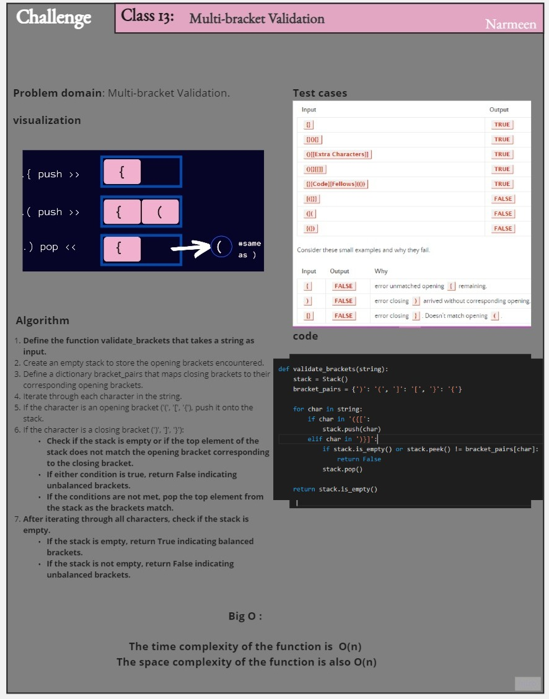
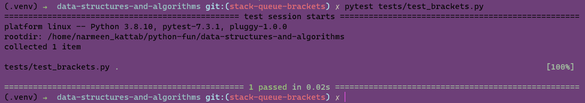

# Multi-bracket Validation.

I write function uses a stack to keep track of the opening brackets encountered.

<!-- Description of the challenge -->

## Whiteboard Process
<!-- Embedded whiteboard image -->

## Approach & Efficiency
<!-- What approach did you take? Why? What is the Big O space/time for this approach? -->
Approach:
The approach  is to iterate through each character of the input string and use a stack to keep track of the opening brackets encountered. When a closing bracket is encountered, it is checked against the top element of the stack to ensure they form a matching pair. If the brackets are balanced, the function returns True; otherwise, it returns False.

Efficiency:
The code has a time complexity of O(n), where n is the length of the input string. This is because the algorithm iterates through each character of the string exactly once.

The space complexity is also O(n) in the worst case. This is because the stack can potentially store all opening brackets if there are no corresponding closing brackets. However, the space used by the stack is directly proportional to the number of unmatched brackets, which is typically smaller than the total number of brackets in the string.

## Solution
<!-- Show how to run your code, and examples of it in action -->

