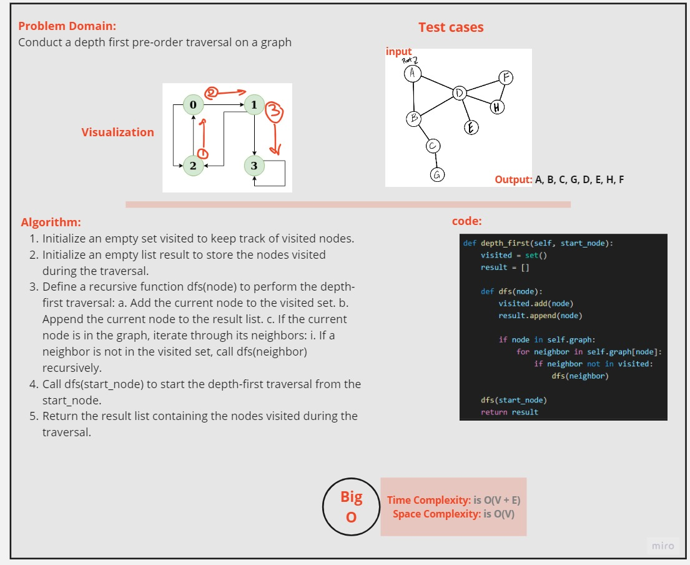

  ## the approach for the depth-first traversal algorithm step by step:

Initialization:

Initialize an empty set called visited to keep track of nodes that have been visited during the traversal.
Initialize an empty list called result to store the nodes in the order they are visited.
Depth-First Search Function (dfs):

Create a recursive function named dfs(node) that takes a node as an argument.
Inside the dfs function:
Add the current node to the visited set.
Append the current node to the result list.
Check if the current node exists in the graph:
If it does, iterate through its neighbors.
For each neighbor:
If the neighbor has not been visited, recursively call dfs(neighbor).
Start Traversal:

Call the dfs function with the start_node as the argument to begin the traversal from the specified starting point.
Return Result:

After the traversal is complete, return the result list containing the order in which nodes were visited.

# whiteboard

# Run in terminal

__pytest tests/test_graphdepth.py__

# Implementation Code and Test
[Code](../scripts/graphdepth.py)

[Test](../tests/test_graphdepth.py)