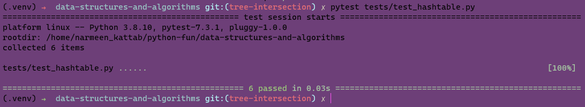

# Implementation: Hash Tables

### Problem Domain:

The problem domain for the `Hashtable` class is the implementation of a hash table data structure. A hash table is used to efficiently store and retrieve key-value pairs. The primary challenge is to handle hash collisions properly, ensuring that different keys don't get mapped to the same index in the internal table.

### Approach:

The approach  is:

1. **Initialization**: The `Hashtable` class is initialized with a fixed table size (100) and an internal list of buckets (the table) initialized with `None`.

2. **Hashing**: To convert a key into an index in the table, the class uses a simple hashing function. It iterates through each character of the key, converts it to its ASCII value using `ord`, and accumulates the sum. Then, the sum is modulo'd by the table size to ensure it fits within the table.

3. **Set Operation**: When setting a key-value pair, the class first calculates the hash for the key and finds the corresponding index in the table. If the bucket at that index is empty, it initializes it as an empty list. If the key already exists in the bucket, it updates the value; otherwise, it appends a new entry for the key-value pair.

4. **Get Operation**: To retrieve a value for a given key, the class calculates the hash and looks for the key in the corresponding bucket. If found, it returns the associated value; otherwise, it returns `None`.

5. **Has Operation**: The class can check whether a given key exists in the hash table by calculating the hash and searching for the key in the corresponding bucket.

6. **Keys Operation**: The `keys` method returns a list of all the keys present in the hash table.

7. **Find Common Values**: The additional method `find_common_values` takes another `Hashtable` as input and returns a set of values found in both hash tables.

### Big O Notation:

- The time complexity for the `set` method is O(1) in the average case, and O(N) in the worst case when there are many collisions in the same bucket. (N is the number of elements in the bucket)
- The time complexity for the `get` method is O(1) in the average case, and O(N) in the worst case when there are many collisions in the same bucket.
- The time complexity for the `has` method is O(1) in the average case, and O(N) in the worst case when there are many collisions in the same bucket.
- The time complexity for the `keys` method is O(N), where N is the number of elements in the hash table.
- The time complexity for the `find_common_values` method depends on the number of elements in both hash tables. In the worst case, it can be O(N^2) if all the elements collide in the same bucket.

# Run in terminal

---
[code](../scripts/hashtable.py)

[Test](../tests/test_hashtable.py)