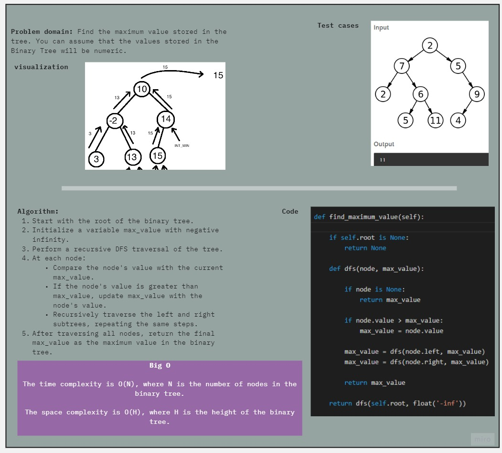
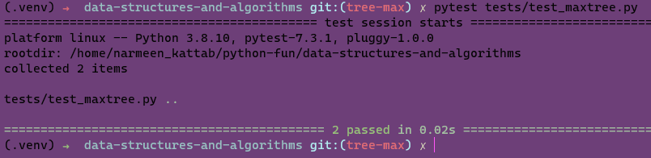

# Maximum Value in a Binary Tree
<!-- Description of the challenge -->
Find the Maximum Value in a Binary Tree

## Whiteboard Process
<!-- Embedded whiteboard image -->

## Approach & Efficiency
<!-- What approach did you take? Why? What is the Big O space/time for this approach? -->

The approach taken to find the maximum value in a binary tree is a depth-first search (DFS) traversal. The algorithm recursively visits each node in the tree, comparing the node's value with the current maximum value encountered so far. By traversing all nodes in the tree, the algorithm finds the maximum value.

The time complexity of this approach is O(N), where N is the number of nodes in the binary tree. This is because the algorithm needs to visit each node exactly once.

The space complexity of the algorithm is O(H), where H is the height of the binary tree. This is due to the recursive nature of the depth-first search. In the worst case, where the binary tree is skewed and resembles a linked list, the height of the tree is equal to the number of nodes, resulting in O(N) space complexity. However, in a balanced binary tree, the height is typically logarithmic with respect to the number of nodes, resulting in a more efficient space usage.

## Solution
<!-- Show how to run your code, and examples of it in action -->
