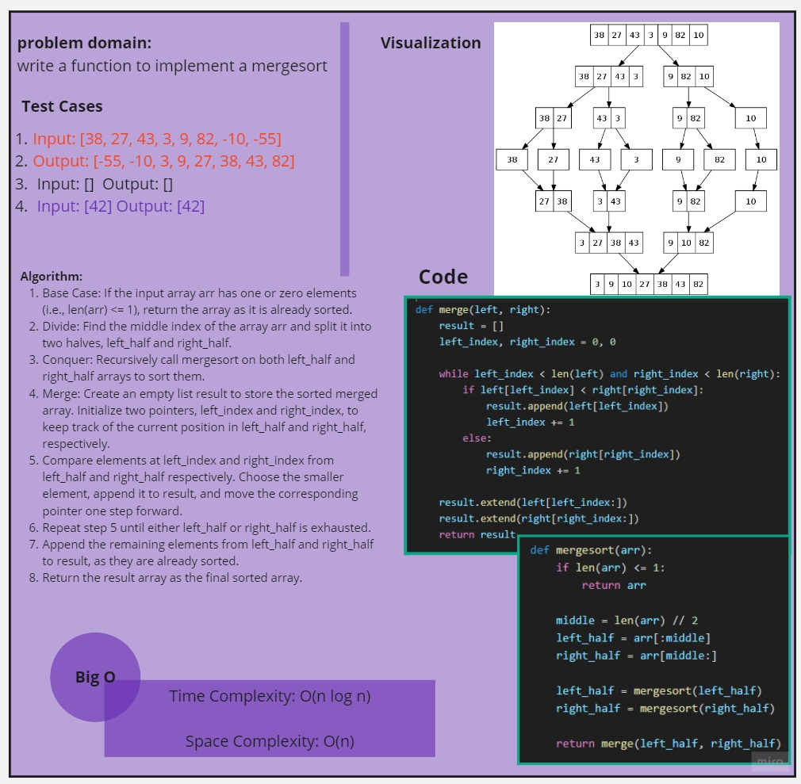
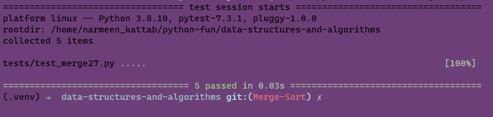

# Merge Sort Explaination

In this article, we will dive into the Merge Sort algorithm and explore its process for sorting an array. Merge Sort is an efficient sorting algorithm that follows the **Divide and Conquer approach**. It works by dividing the input array into two halves, recursively sorting each half, and then merging them back together to produce the sorted output.

## How Merge Sort works:

1. **Divide**: The input array is divided into two halves, approximately equal in size.
2. **Conquer**: Each half is sorted recursively using Merge Sort.
3. **Merge**: The sorted halves are merged back together to create the final sorted array.

## The Process

Let's apply the Merge Sort algorithm to the following sample array: [8, 4, 23, 42, 16, 15]. We'll visually represent the array after each iteration of the algorithm.

### Step 1: Initial Array

[8, 4, 23, 42, 16, 15]

### Step 2: Divide

We divide the array into two halves:

Left half: [8, 4, 23]
Right half: [42, 16, 15]

### Step 3: Recursive Sorting

Now, we recursively apply Merge Sort to each half.

**Sorting Left Half**

Left half: [8, 4, 23]

Divide:
Left half: [8]
Right half: [4, 23]

The left half is already sorted as it contains only one element.

**Sorting Right Half**

Right half: [42, 16, 15]

Divide:
Left half: [42]
Right half: [16, 15]

Divide:
Left half: [16]
Right half: [15]

The right half is already sorted as it contains only one element.

### Step 4: Merge

Now, we merge the sorted left and right halves back together.

Merge [8] and [4, 23]:
Merged: [4, 8, 23]

Merge [42] and [16, 15]:
Merged: [15, 16, 42]

Merge [4, 8, 23] and [15, 16, 42]:
Merged: [4, 8, 15, 16, 23, 42]

### Step 5: Final Sorted Array

The final sorted array is [4, 8, 15, 16, 23, 42].

## White board

## Run in terminal

## Code
__Code__
[code27](../scripts/merge27.py)

__Test__
[test27](../tests/test_merge27.py)