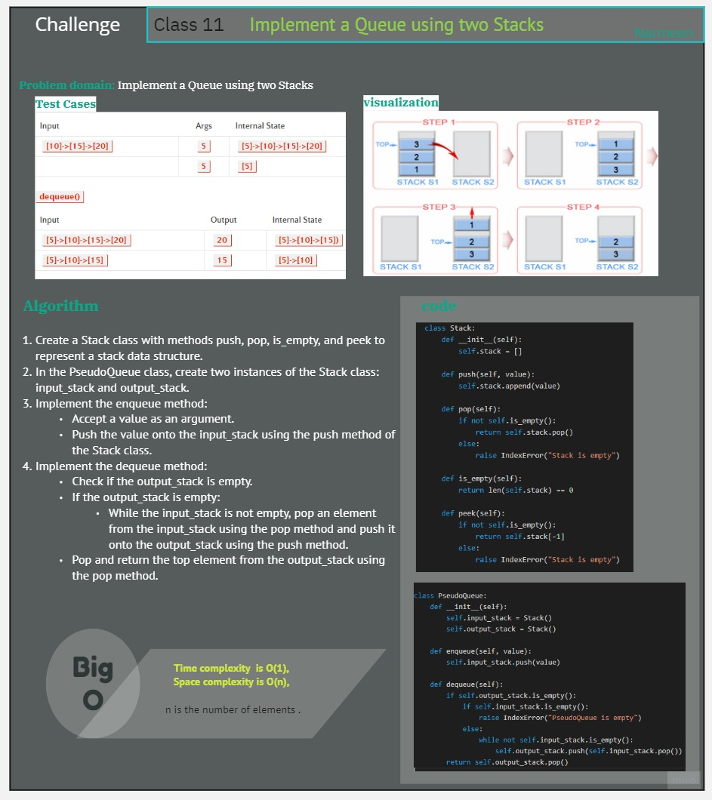
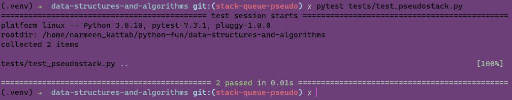

# Code Challenge: Class 11

<!-- Description of the challenge -->
Implement a Queue using two Stacks.


## Whiteboard Process
<!-- Embedded whiteboard image -->




## Approach & Efficiency
<!-- What approach did you take? Why? What is the Big O space/time for this approach? -->
The time complexity of enqueue and dequeue operations in the PseudoQueue implementation is O(1), and the space complexity is O(n), where n is the number of elements in the queue.
## Solution
<!-- Show how to run your code, and examples of it in action -->
in the command line :

 ```pytest tests/test_pseudostack.py```



code: [codep](../scripts/pseudostack.py)

test: [testp](../tests/test_pseudostack.py)