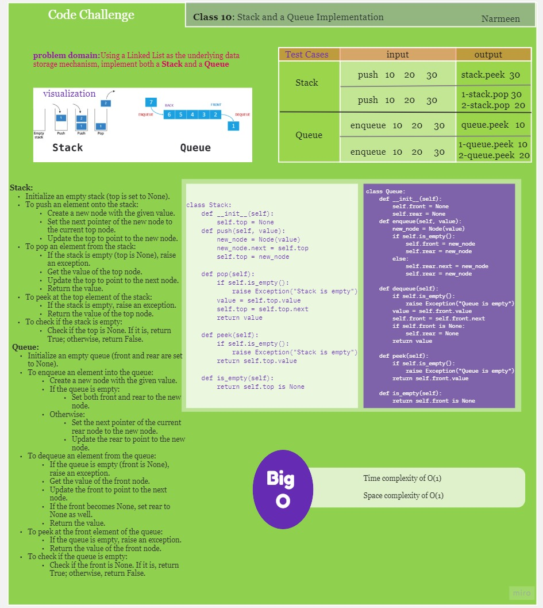
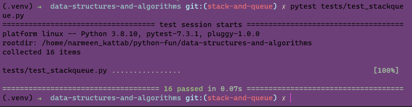

# Stacks and Queues
Challenge Type: New Implementation
Using a Linked List as the underlying data storage mechanism, implement both a Stack and a Queue

## Whiteboard Process
<!-- Embedded whiteboard image -->

## Approach & Efficiency
<!-- What approach did you take? Why? What is the Big O space/time for this approach? -->
 The code has a time complexity of O(1) for all operations and a space complexity of O(1).
## Solution
<!-- Show how to run your code, and examples of it in action -->

python3 tests/test_stackqueue.py
