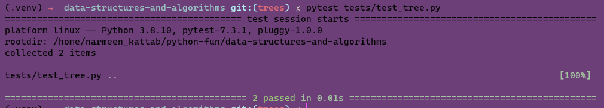

# Trees
<!-- Description of the challenge -->
Implementation of binary trees and binary search trees, along with performing depth-first traversals and search operations in these data structures.
## Whiteboard Process
<!-- Embedded whiteboard image -->

## Approach & Efficiency
<!-- What approach did you take? Why? What is the Big O space/time for this approach? -->
__The approach__ taken in the code is to define separate classes for the binary tree and binary search tree, allowing for better organization and separation of concerns. The code utilizes recursive algorithms for the depth-first traversals and search operations.

__BIG O:__

the time complexity is dominated by the depth-first traversals and adding nodes in the binary search tree, while the space complexity is determined by the size of the resulting traversal arrays.

## Solution
<!-- Show how to run your code, and examples of it in action -->
