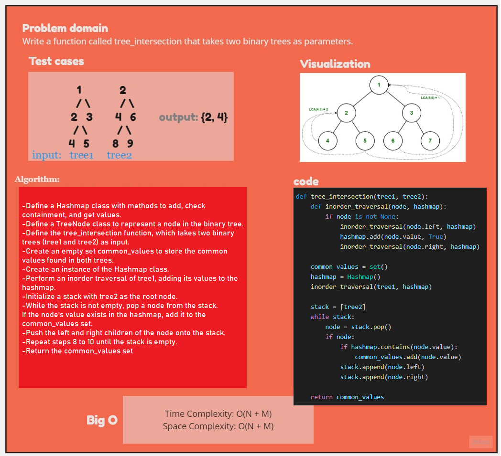

# lab-32:Tree intersection


## problem domain:

Given two binary trees tree1 and tree2, the function tree_intersection finds and returns a set containing the values that are common in both trees.

## Approach:
The tree_intersection function finds the common values that are present in both binary trees (tree1 and tree2). It uses a hash map to store the values of tree1 during an inorder traversal and then traverses tree2 to check if the values exist in the hash map. Common values are added to the common_values set, which is returned as the final result.

## Big O notation

The time complexity  is O(n + m), where n is the number of nodes in tree1, and m is the number of nodes in tree2.

The space complexity is O(n)


## White board

## Run in terminal
```pytest tests/test_tree_intersection.py```


## The implementation code and tests
__Code__
[code32](../scripts/tree_intersection.py)

__Test__
[test32](../tests/test_tree_intersection.py)